## Outline for today {.smaller}

- **#tidytuesday: a weekly social data project**
  - #tidytuesday as a helpful, fun practice
  - My experience with #tidytuesday
- Geofacet-ing in R
- Live walkthrough with unregulated drinking water contaminant monitoring data
- Q&A and summary

## About me {.smaller}

- Jahred Liddie, Postdoctoral Associate in the Water, Health, and Opportunity Lab at GWSPH

- Research focuses: drinking water quality, exposure assessment, emerging contaminants, and environmental justice

- Hobbies: flute, tennis, and playing with my dog, Georgette

<center>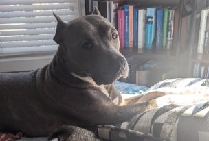{width="350"}</center>

## What is #tidytuesday? {.smaller}

- #tidytuesday is a weekly social data project organized by the [Data Science Learning Community](https://dslc.io/) since 2018

- Each Monday, a curated dataset is posted to their [Github repo](https://github.com/rfordatascience/tidytuesday)

- Participants explore the data and share visualizations on social media (formerly on Twitter, now Bluesky)

<center>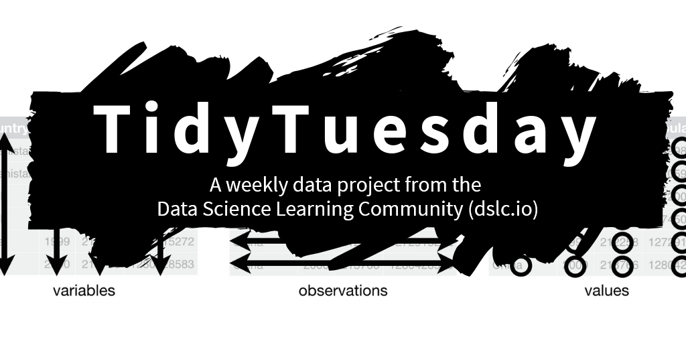{width="420"}</center>

## Some other notes on TidyTuesday {.smaller}

- Participants also encouraged to share code. This is nice since there are some very experienced R users with public TidyTuesday portfolios!
- The focus is on **exploring** data, rather than establishing causal relationships.
- Participants can also submit datasets for future weeks

## Past example datasets {.smaller}

- Bob Ross paintings

- Weekly US gas prices

- *Stranger Things* dialogue

- A dataset of all Pokemon and their stats (available from the `pokemon` package)

<center>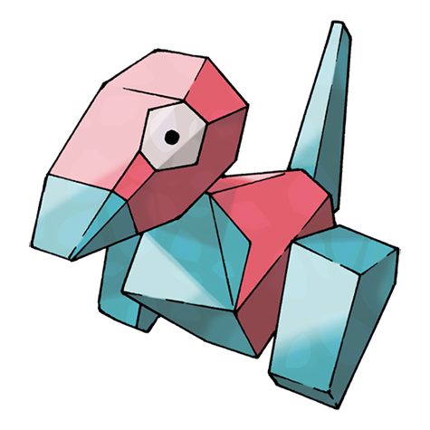{width="200"}</center>

## My experience with TidyTuesday {.smaller}

- I participated first in 2022 as a way to improve my data visualization skills
- Also enjoyed the community
- My full portfolio is available [here](https://github.com/jahredwithanh/tidytuesday/tree/main)

## Some resources I found helpful... {.smaller}

- [The R Graph Gallery](https://r-graph-gallery.com/): to give me ideas for different chart types
- [R-Charts.com](https://r-charts.com/): a similar website, but with more base R and leaflet examples
- Other people's #tidytuesday repos
- Note: in the age of more widespread LLMs, I find these useful to go to if I'm stuck on a specific formatting issue, but certainly not for making a plot from scratch

## My very first plot {.smaller}

<small>Key packages: `cowplot`, `ggtext`</small>

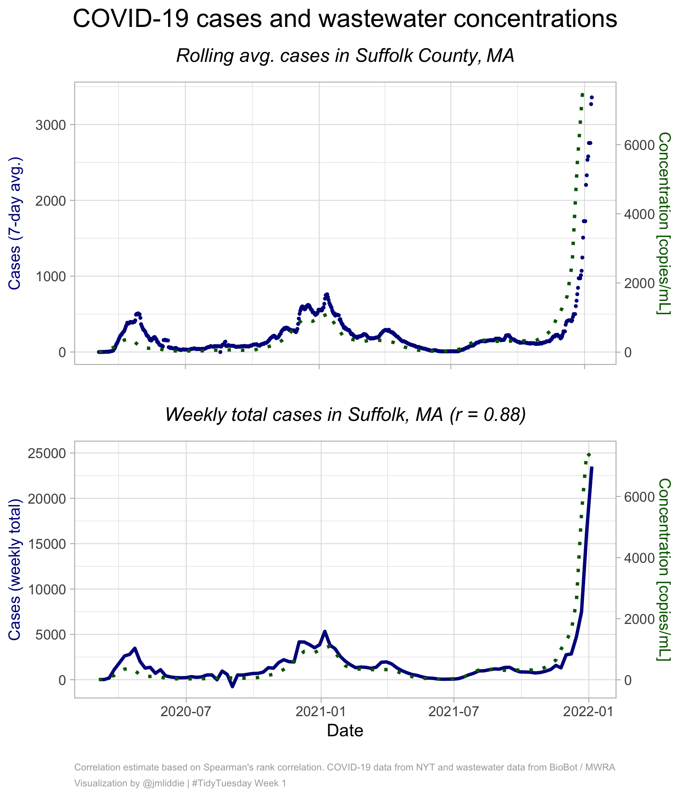{fig-align="center" width="550"}

## Other examples (pt 1) {.smaller}

<small>Key packages: `showtext`, `ggrepel`</small>

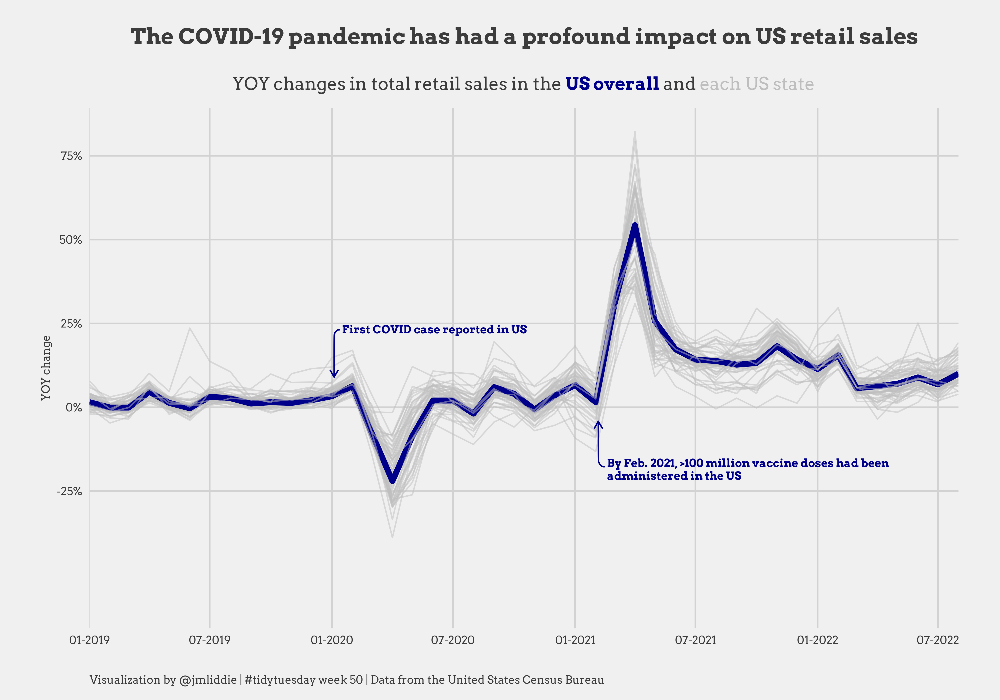{fig-align="center"}

## Other examples (pt 2) {.smaller}

<small>Key packages: `showtext`, `ggrepel`</small>

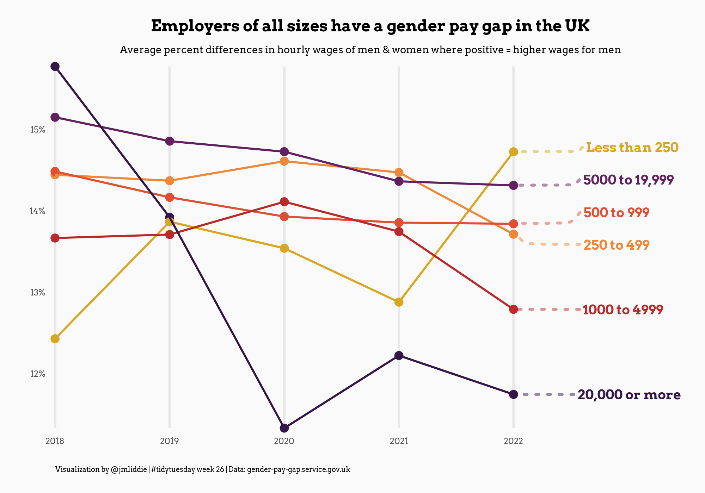{fig-align="center"}

## Other examples (pt 3) {.smaller}

<small>Key packages: `gganimate`, `ggtext` </small>

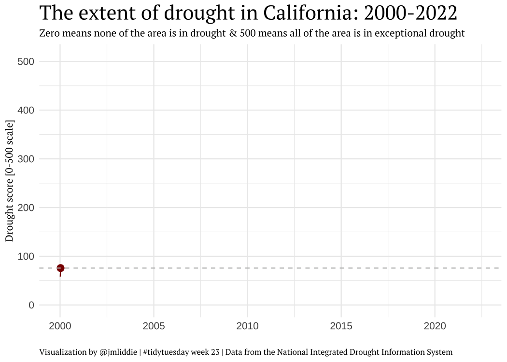{fig-align="center"}

## Other examples (pt 4) {.smaller}

<small>Key packages: `sf`, `ggimage`, `ggmap` </small>

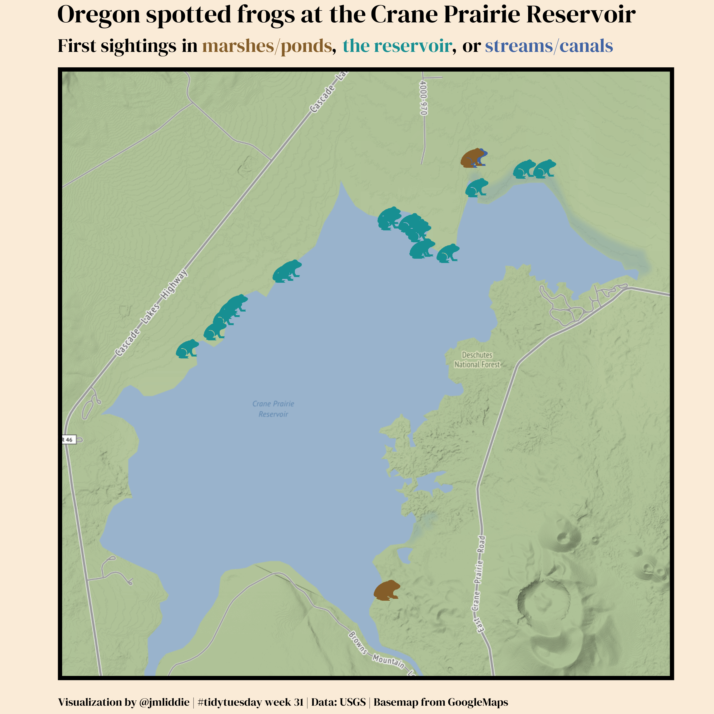{fig-align="center"}

## WEB Du Bois data portraits (pt 1) {.smaller}

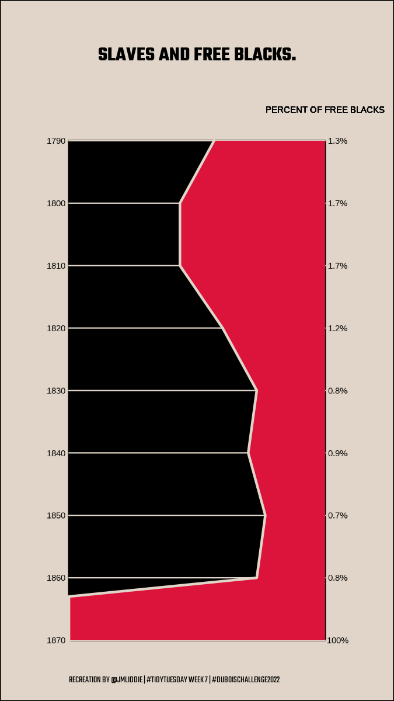{fig-align="center"}

## WEB Du Bois data portraits (pt 2) {.smaller}

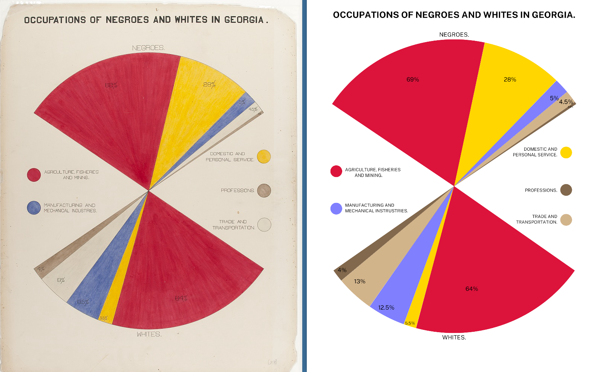{fig-align="center"}

## Other examples (pt 5) {.smaller}

<small>Key packages: `geosphere`, `ggmap` </small>

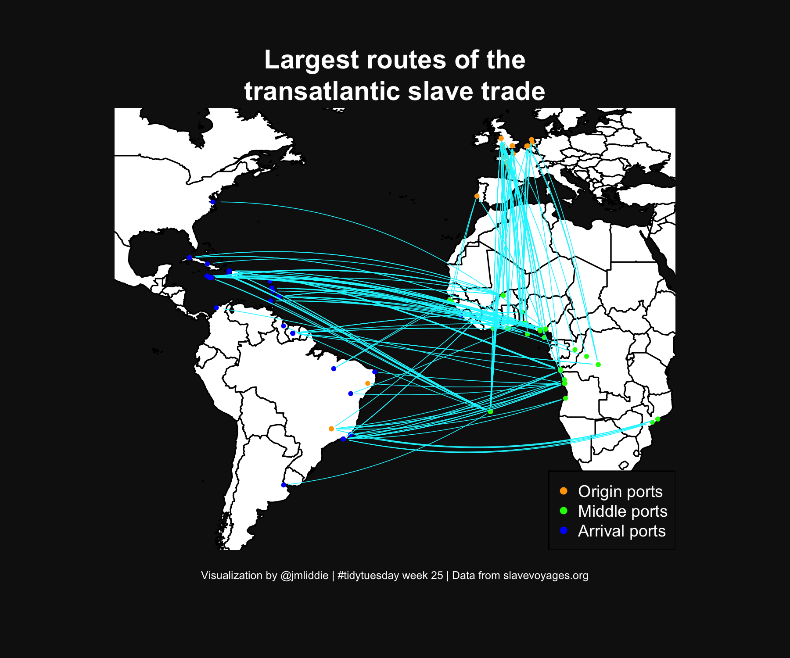{fig-align="center"}

## Other examples (pt 6) {.smaller}

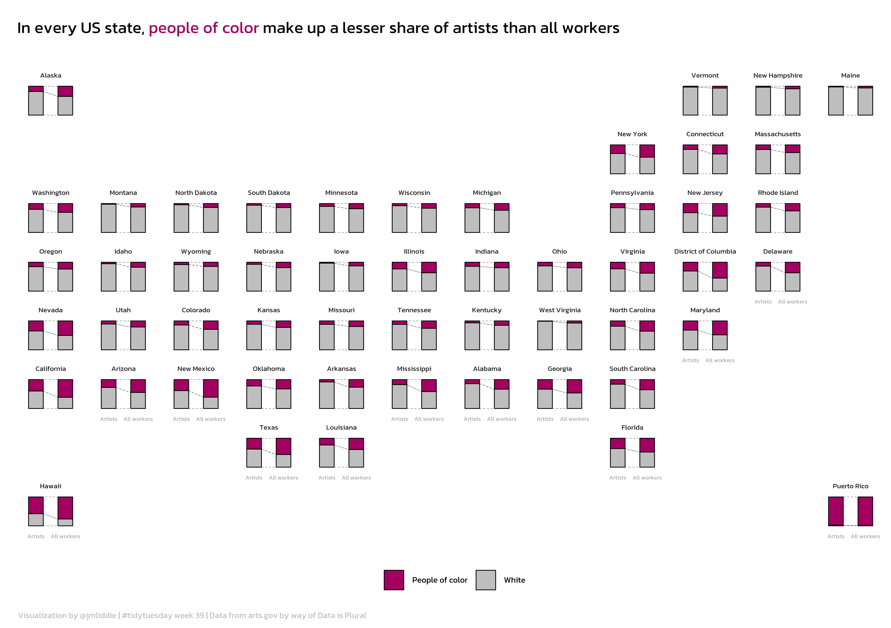{fig-align="center" width="5300"}

## What is `geofacet`? {.smaller}

>[`geofacet`](https://hafen.github.io/geofacet/) is a package developed by Ryan Hafen to display a sequence of plots (like normal `facet`ing) but within a structure that preserves the original geographical orientation

{fig-align="center" width="2500"}

## Let's look at some code...(pt 1) {.smaller}

Load necessary libraries and the data...

```{r}

library(tidyverse)
library(showtext)
library(geofacet)
library(ggalluvial)
library(ggtext)

# load data and state helper dataframe
artists <- readr::read_csv('https://raw.githubusercontent.com/rfordatascience/tidytuesday/master/data/2022/2022-09-27/artists.csv')

names(artists)

```

## Let's take a look at some code (pt 2) {.smaller}

```{r}
states <- rbind(
  data.frame(state = datasets::state.name, 
             state.abb = datasets::state.abb),
  data.frame(state = c("District\nof Columbia", "Puerto Rico"),
             state.abb = c("DC", "PR"))
)

# set up data for plotting, calculate necessary new vars
artists <- artists %>%
  mutate(POC = ifelse(race == "White", "White", "People of color"))

state.summaries <- artists %>%
  group_by(state, POC) %>%
  summarise(artists_n = sum(artists_n, na.rm = T),
            workers_n = sum(all_workers_n)) %>%
  ungroup()

totals <- artists %>%
  group_by(state) %>%
  summarise(total_artists = sum(artists_n, na.rm = T),
            total_workers = sum(all_workers_n)) %>%
  ungroup()

state.summaries <- left_join(state.summaries, totals)

state.summaries$perc_artists <- state.summaries$artists_n / state.summaries$total_artists
state.summaries$perc_workers <- state.summaries$workers_n / state.summaries$total_workers
state.summaries$diff <- state.summaries$perc_workers - state.summaries$perc_artists

```

## Let's look at some code (pt 3) {.smaller}

```{r}
# finally, convert to plot format needed
state.summaries <- state.summaries %>%
  select(state, POC, perc_artists, perc_workers) %>%
  pivot_longer(cols  = c("perc_artists", "perc_workers"), names_to = "type")

state.summaries <- state.summaries %>%
  mutate(type.clean = ifelse(type == "perc_artists", "Artists", "All workers")) %>%
  mutate(type.clean = factor(type.clean, levels = c("Artists", "All workers")))

state.summaries <- left_join(state.summaries, states)

# grid of states
my_grid <- us_state_grid2

# adding puerto rico manually
my_grid <- rbind(my_grid,
                 data.frame(row = 8, col = 12, code = "PR", name = "Puerto Rico")
                 )

```

## What does the `my_grid` object look like? {.smaller}

```{r}

head(my_grid)

```

```{r}

tail(my_grid)

```

## Let's look at some code (pt 4) {.smaller}

```{r, eval=FALSE}
# nice font
font_add_google("Kanit")
showtext_auto(enable = TRUE)

ggplot(state.summaries, aes(x = type.clean, y = value)) +
  geom_flow(aes(alluvium = POC), lty = 2, fill = "white", color = "black",
            curve_type = "linear", width = 0.5, size = 0.15) +
  geom_col(aes(fill = POC), width = 0.5, color = "black", size = 0.25) +
  scale_fill_manual(values = c("#a40062","grey"), name = "") +
  labs(x = "", y = "", title = "In every US state, <span style = 'color: #a40062;'>people of color</span> make up a lesser share of artists than all workers",
       caption = "Visualization by @jmliddie | #tidytuesday week 39 | Data from arts.gov by way of Data is Plural") +
  theme_minimal() +
  theme(plot.title = element_markdown(margin = margin(t = 10, b = 20), hjust = 0, 
                                      lineheight = 2, size = 70, family = "Kanit"),
        plot.caption = element_markdown(hjust = 0, margin = margin(t = 10), color = "grey",
                                        lineheight = 1.4, size = 35, family = "Kanit"),
        axis.ticks = element_blank(),
        axis.text.y = element_blank(),
        axis.text.x = element_text(size = 25, color = "darkgrey", family = "Kanit"),
        strip.text.x = element_text(size = 30, family = "Kanit"),
        panel.grid.major = element_blank(),
        panel.grid.minor = element_blank(),
        legend.position = "bottom",
        legend.text = element_text(size = 35, color = "black", family = "Kanit"),
        legend.key.size = unit(0.5, 'cm')) +
  facet_geo(~state, grid = my_grid, label = "name")

ggsave("2022/2022 - Week 23/artists.png", dpi = 600, width = 8.5, height = 6, bg = "white")

```

## Many other regions are supported! {.smaller}

<small>There are 216 grids available in the latest version of `geofacet` and users can submit their own directly using `grid_submit()`!</small>

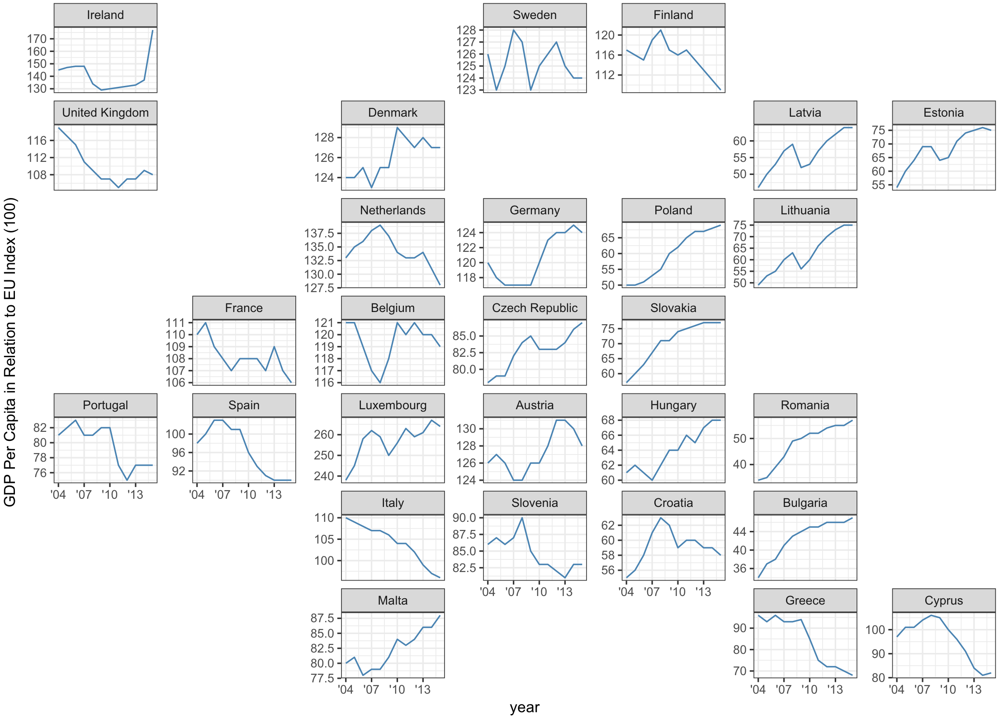{fig-align="center" width="800"}

# Let's work through an example live {.smaller-title}

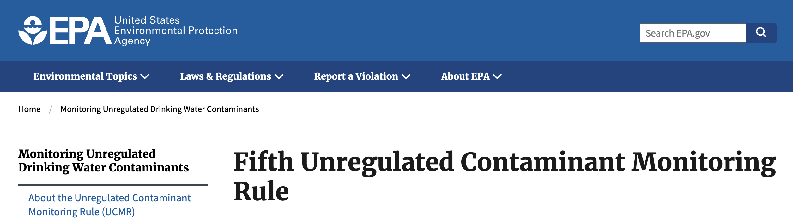{fig-align="center"}

## US EPA drinking water monitoring {.smaller}

::: incremental
- The US Environmental Protection Agency (EPA) monitors a list of *unregulated* contaminants every five years in public water systems as part of the Unregulated Contaminant Monitoring Rule (UCMR). The fifth cycle included 29 different PFAS (per- and polyfluoroalkyl substances or "forever chemicals") and lithium.
- *We'll use the most recent release of these data to visualize trends in PFAS monitoring over time across different states. Download zip file from the [course website](https://pubh6199-data-viz-with-r.github.io/2026-Summer/class/10-recreate-viz/10-recreate-viz.zip). The zip file contains `lab5.qmd`, which uses a pre-processed dataset, `ucmr5_dat.csv`*
:::
