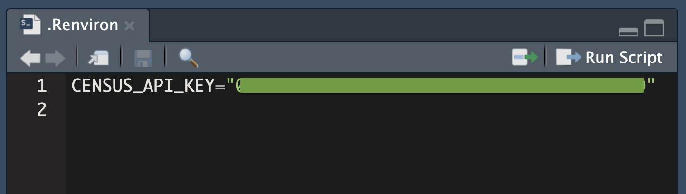
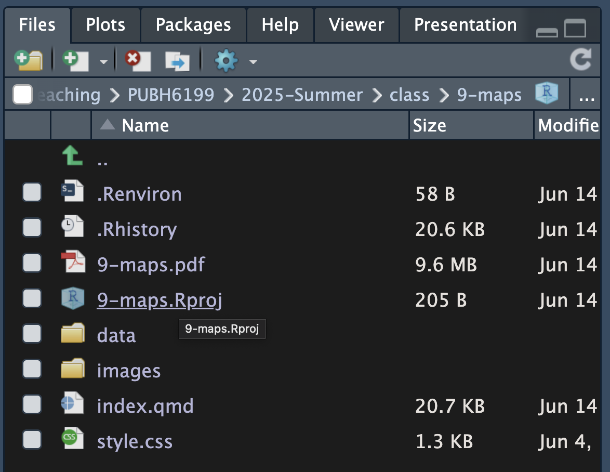

## No Class Today {.smaller}

**Reading assignment**:

- [Mapping water insecurities in R with tidycensus](https://waterdata.usgs.gov/blog/acs-maps/#visualizing-total-population-vs-percent-lacking-plumbing-across-counties-in-the-western-us)

- [Basic usage of `{tidycensus}`](https://walker-data.com/tidycensus/articles/basic-usage.html)

- [R for Data Science (2e), Chapter 11 – Visualize](https://r4ds.hadley.nz/visualize)


**Lab**:

Please accept the Lab 5 assignment on GitHub Classroom and follow the tutorial on your own time. See the `#announcement` channel in Slack for the link. As always, labs are due next Monday June 23, 2025, at 11:59 PM.

## How to store API key without committing it to GitHub {.smaller-title}

::: smaller
To use the `{tidycensus}` package, you need to set up a Census API key. You can obtain one from the [Census Bureau's website](https://api.census.gov/data/key_signup.html).

You can store your API key in a `.Renviron` file in your repository's root directory (same directory as your `.Rproj`). Add `.Renviron` to `.gitignore` so that this file is not committed to GitHub.
:::

::: {.column width="50%"}



:::

::: {.column width="50%"}



:::

## How to store API key without committing it to GitHub {.smaller-title}

::: {.column width="60%"}

::: smaller

Then in your R scripts, you can access the API key using `Sys.getenv("CENSUS_API_KEY")`. This way, you can use the API key without hardcoding it into your scripts.

```{r}
#| echo: true
#| eval: false
library(tidycensus)
invisible(
  census_api_key(Sys.getenv("CENSUS_API_KEY"), install = TRUE, overwrite = TRUE)
)
options(tigris_use_cache = TRUE)
```

:::
:::

::: {.column width="10%"}
:::

::: {.column width="30%"}

**Protect yourself against this!**


::: citation
Source: [Reddit](https://www.reddit.com/r/ProgrammerHumor/comments/yziv9u/never_pay_for_apis_again_with_this_simple_trick/)
:::


:::
