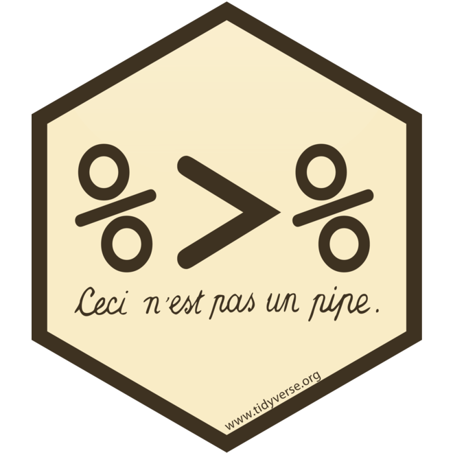
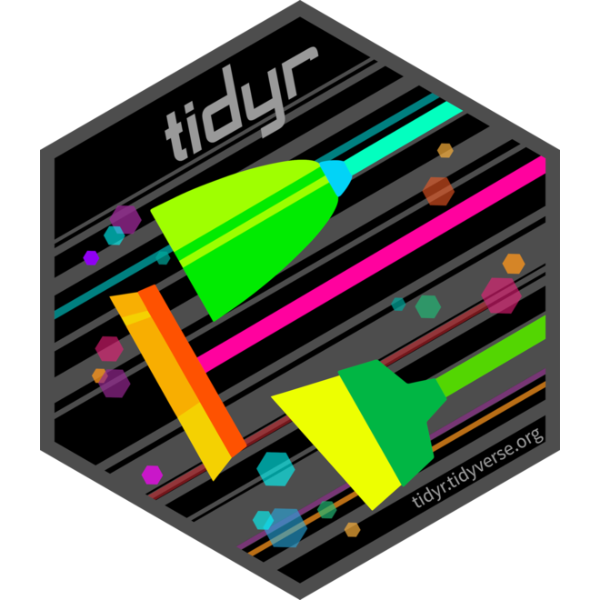
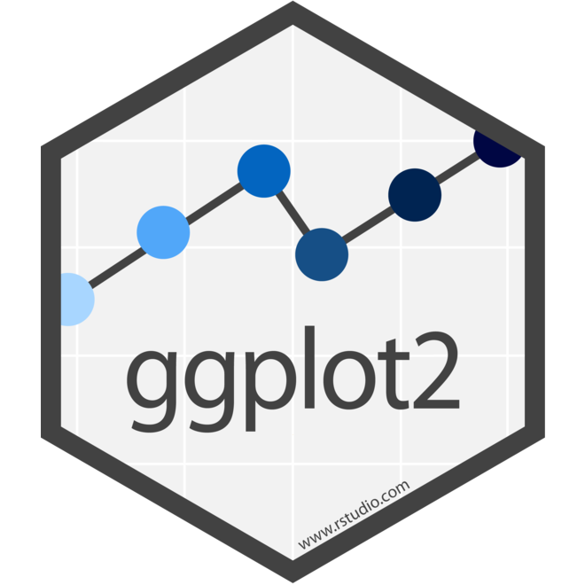
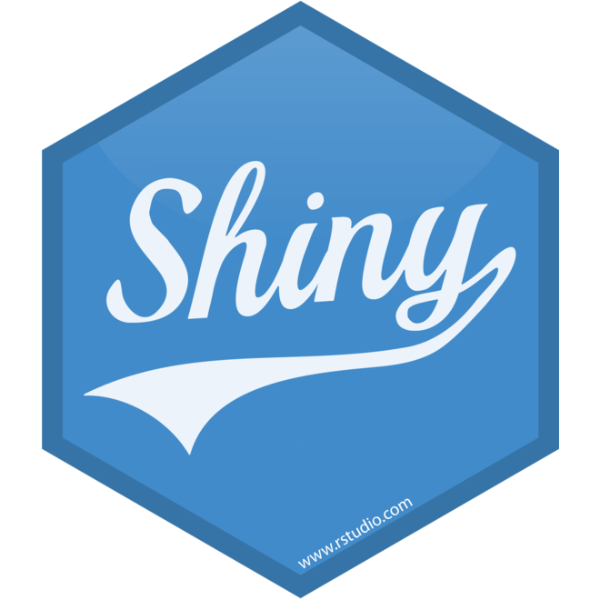
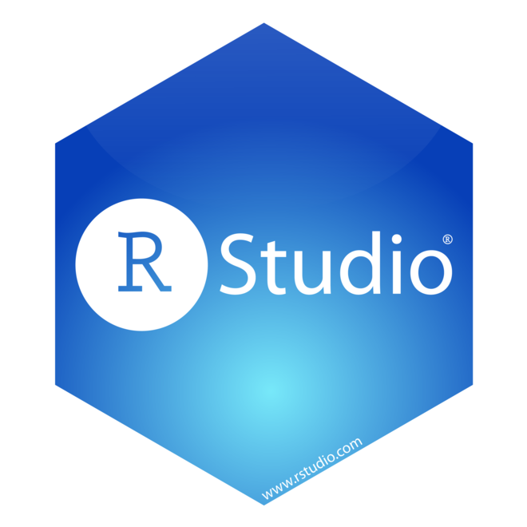
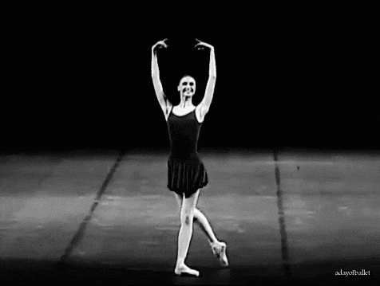
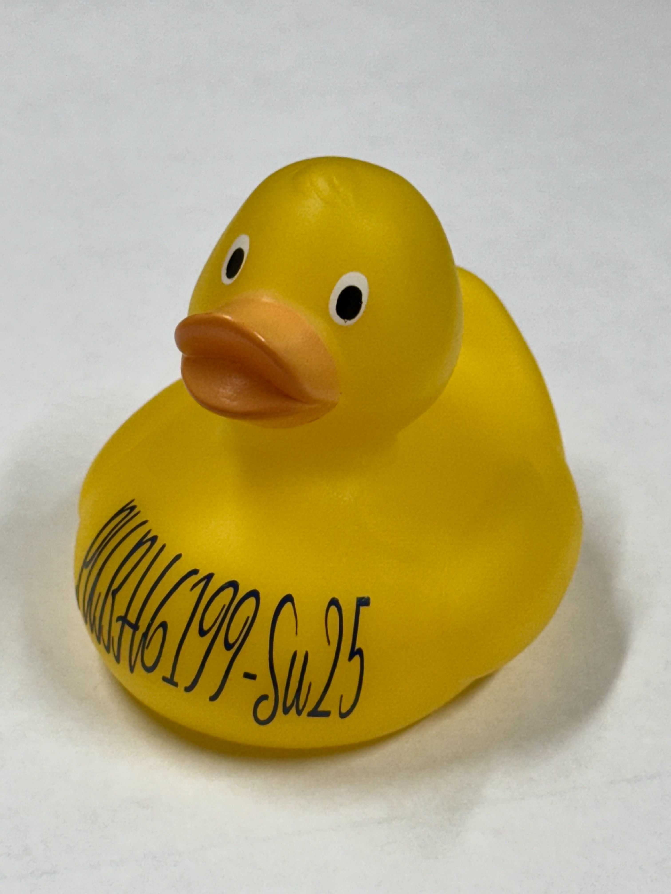

## Final data visualization product {.smaller}

Choose one from the following three options:

- **Same Question, Different Audiences (3 static charts)**:
_Create three visualizations that answer the same question, each designed for a different audience (e.g., general public, policy makers, technical experts)._

- **Same Data, Different Questions (3 static charts)**:
_Use the same dataset to answer three different but related questions, each with its own focused visualization._

- **Interactive Dashboard (1 app with 3 components)**:
_Build an interactive dashboard (e.g., with shiny, plotly, or similar tools) that includes at least three visual components for exploring your data dynamically._

::: takeaway
Accompanying your visualizations, you should also include a **write-up around 500-1000 words** that consists of an introduction, research questions, data sources, data wrangling, data visualizations, findings, and conclusion.
:::

## Final project presentation {.smaller}
- **10 minutes** presentation
- What questions do you set out to answer with your visualizations? Why are they important?
- Your **data source** and why they are chosen to answer your questions
- Your intended audience
- Two to three **visualization design choices** and how they help tell your story
- Two to three **takeaways** from your visualizations that your audience should remember
- **Live demo** of your visualizations (if applicable)
- One to two **challenges** you encountered during this project and how you overcame them
- One to two **achievements** you are proud of in this project
- The presentation format is flexible, bring your laptop to present, and submit the presentation and final data visualization product as `HW6`

## Final project showcase schedule {.smaller}
<table>
  <thead>
    <tr style="background-color: #d3d3d3;">
      <th>Team</th>
      <th>Members</th>
      <th>Time slot</th>
    </tr>
  </thead>
  <tbody>
    <tr>
      <td>Maggie</td>
      <td>Jordi Fischbach, Ahmed Shah</td>
      <td>3:20 - 3:30 pm</td>
    </tr>
    <tr>
      <td>Homer</td>
      <td>Alia Jamil, Nina Wubu</td>
      <td>3:35 - 3:45 pm</td>
    </tr>
    <tr>
      <td>Marge</td>
      <td>Amel Attalla, Belen Zemas</td>
      <td>3:50 - 4:00 pm</td>
    </tr>
    <tr>
      <td>Bart</td>
      <td>Sora Ely, Ashlan Jackson</td>
      <td>4:05 - 4:15 pm</td>
    </tr>
    <tr>
      <td>Lisa</td>
      <td>Riya Belani, Molayo Ifebajo</td>
      <td>4:20 - 4:30 pm</td>
    </tr>
    <tr style="background-color: #fff3cd;">
      <td>Fill out peer evaluations</td>
      <td>All</td>
      <td>4:30 - 4:40 pm</td>
    </tr>
    <tr style="background-color: #fff3cd;">
      <td>Tally peer evaluations</td>
      <td>Teaching team</td>
      <td>4:40 - 4:50 pm</td>
    </tr>
    <tr style="background-color: #fff3cd;">
      <td>Announce award winners!</td>
      <td>All</td>
      <td>4:50 - 5:00 pm</td>
    </tr>
  </tbody>
</table>

##  Announcing Award Winners {background="#033C5A"}
 
 
 

 Congratulations to the following winners! 

*~ Drum roll, please ~*

## Smoothest Pipeline Award

_For piping it all together with grace and clarity._

. . .

::: {.column width="50%"}

Team Lisa

- Molayo Ifebajo
- Riya Belani

:::

::: {.column width="50%"}

:::

## Cleanest Data Workflow

_For untangling the mess and tidying like a pro._

. . .

::: {.column width="50%"}

Team Bart

- Sora Ely
- Ashlan Jackson
:::

::: {.column width="50%"}

:::

## Most Stunning Visualization

_For plotting like an artist and letting the data speak._

. . .

::: {.column width="50%"}

Team Maggie

- Jordi Fischbach
- Ahmed Shah
:::

::: {.column width="50%"}

:::

## Best Shiny App

_For making your data shine with interactivity and style._

. . .

::: {.column width="50%"}

Team Maggie

- Jordi Fischbach
- Ahmed Shah
:::

::: {.column width="50%"}

:::

## Best Quarto Report

_For seamless communication of complex work through a polished and reproducible report._

. . .

::: {.column width="50%"}

Team Marge

- Amel Attalla
- Belen Zemas
:::

::: {.column width="50%"}

:::

## Best Team Collaboration

_For showing that collaboration is the most powerful package of all._

. . .

::: {.column width="50%"}

Team Homer

- Alia Jamil
- Nina Wubu
:::

::: {.column width="50%"}

:::

## Thank you for a great semester! {.smaller}

::: {.column width="70%"}

::: citation
[Source: tumblr](https://adayofballet.tumblr.com/post/100130369284/svetlana-zakharova)
:::
:::

::: {.column width="30%"}

::: {.fragment}
 
 
{width="200px"}
**Keep calm and quack on!**
:::

:::

## Please fill out the course evaluation!

