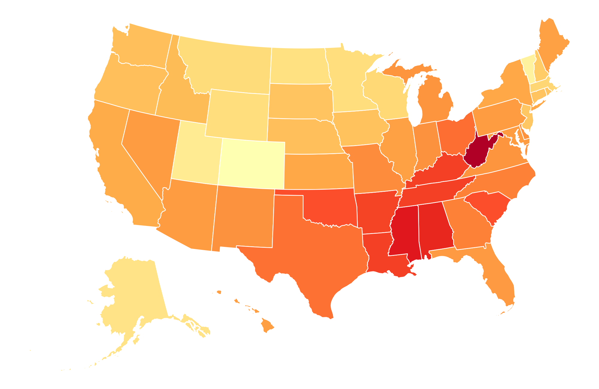
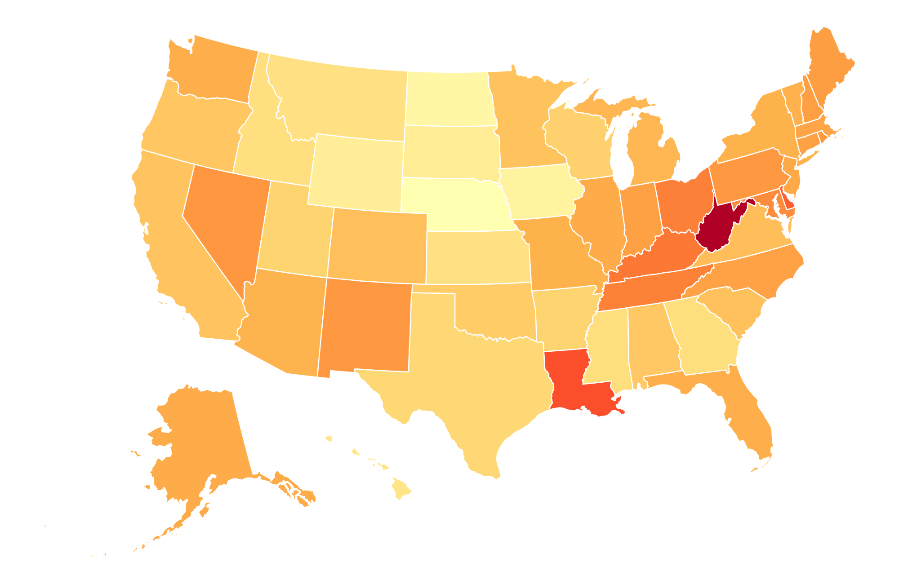
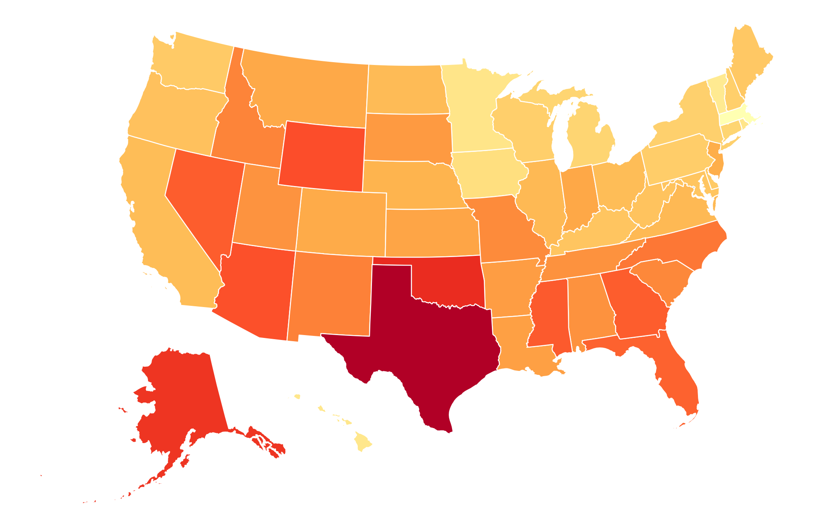
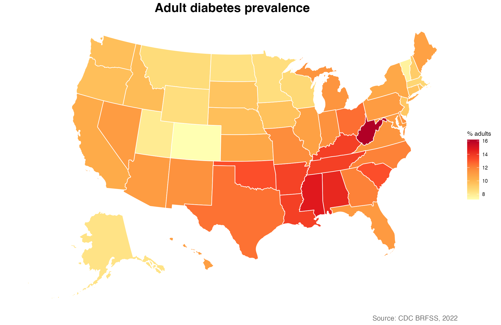
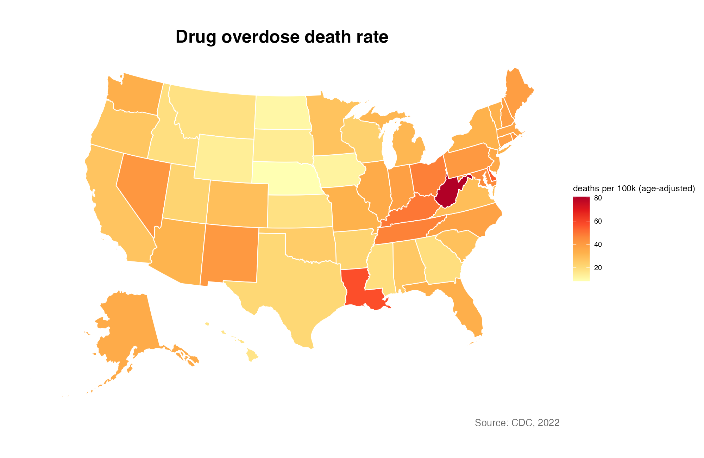
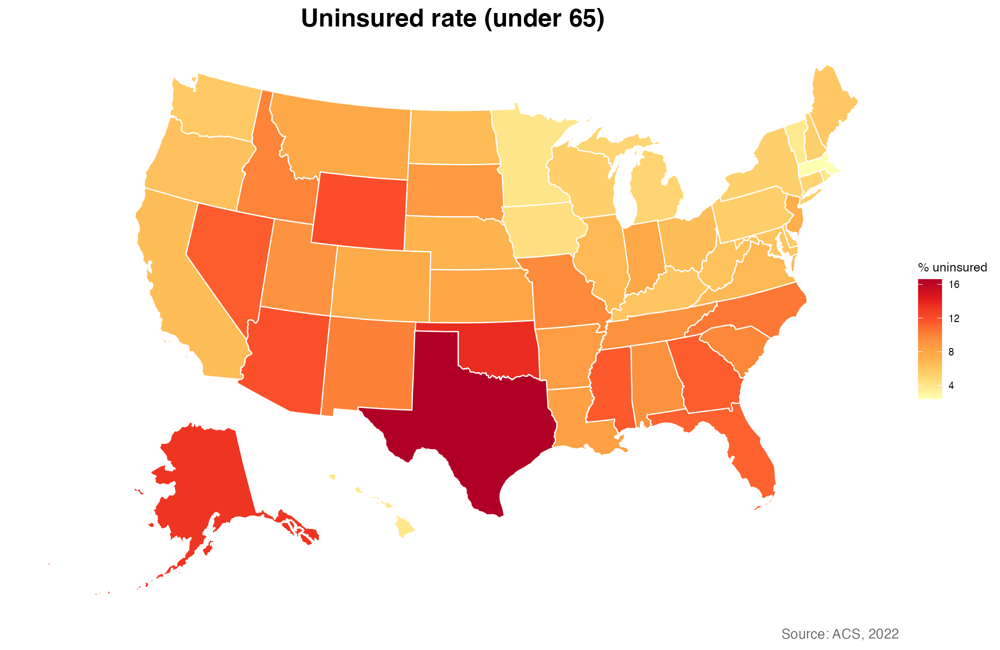

<!-- ============================================================
     "Guess That Map" — 5-min in-class activity
     Paste into index.qmd wherever it fits the flow.
     Requires: images/guess_map_{1,2,3}{,_reveal}.png produced by
     make_guess_maps.R (run once before class).
     ============================================================ -->

## {background-image="images/in-class-activity.png"}

::: {style="text-align: center; font-size: 80%;"}
<br><br>

**Guess That Map** &nbsp; 🗺️

You'll see 3 U.S. choropleths with their titles and legends removed.
Each shows a different public-health variable.

- Write your 3 guesses on a slip of paper (or drop in Slack)
- First correct guess on each map wins a sticker 🌟
- Variables are picked from a known list — shown after the timer

:::

```{r}
countdown::countdown(
  minutes = 4,
  bottom = 0,
  play_sound = TRUE,
  color_border              = "#FFFFFF",
  color_text                = "#7aa81e",
  color_running_background  = "#7aa81e",
  color_running_text        = "#FFFFFF",
  color_finished_background = "#ffa07a",
  color_finished_text       = "#FFFFFF",
  font_size = "2em",
)
```

## Map #1 {.smaller-title}

{fig-align="center" width="85%"}

## Map #2 {.smaller-title}

{fig-align="center" width="85%"}

## Map #3 {.smaller-title}

{fig-align="center" width="85%"}

## The pool — pick from these {.smaller}

::: {style="text-align: center; font-size: 90%;"}

- Diabetes prevalence
- Drug overdose deaths
- Uninsured rate
- Broadband access
- Life expectancy
- % bachelor's degree

:::

## Map #1 — the reveal {.smaller-title}

{fig-align="center" width="85%"}

## Map #2 — the reveal {.smaller-title}

{fig-align="center" width="85%"}

## Map #3 — the reveal {.smaller-title}

{fig-align="center" width="85%"}

## Why was that so hard? {.smaller}

::: {style="text-align: left; font-size: 85%;"}

All three maps highlight the **South + Appalachia**, but they're measuring
very different things — diabetes, overdose deaths, and the uninsured rate.

They look similar because they all track the same underlying **socioeconomic
gradient**: poverty, education, and access to care concentrate in the same
regions, so most state-level public-health choropleths end up looking like
*the same map*.

**Takeaways for your own maps:**

- A choropleth without a title and legend is nearly useless — the map shape
  alone usually doesn't tell you what variable it shows.
- "South is darker" is rarely the insight. Ask what your map adds *beyond*
  the SES baseline (e.g., the Mountain West shows up in overdoses; Texas
  stands out for uninsured — those are the real signals).
- Consider mapping the **residual** from a baseline, or showing **rates of
  change**, rather than levels, when the level map just recovers SES.

:::
